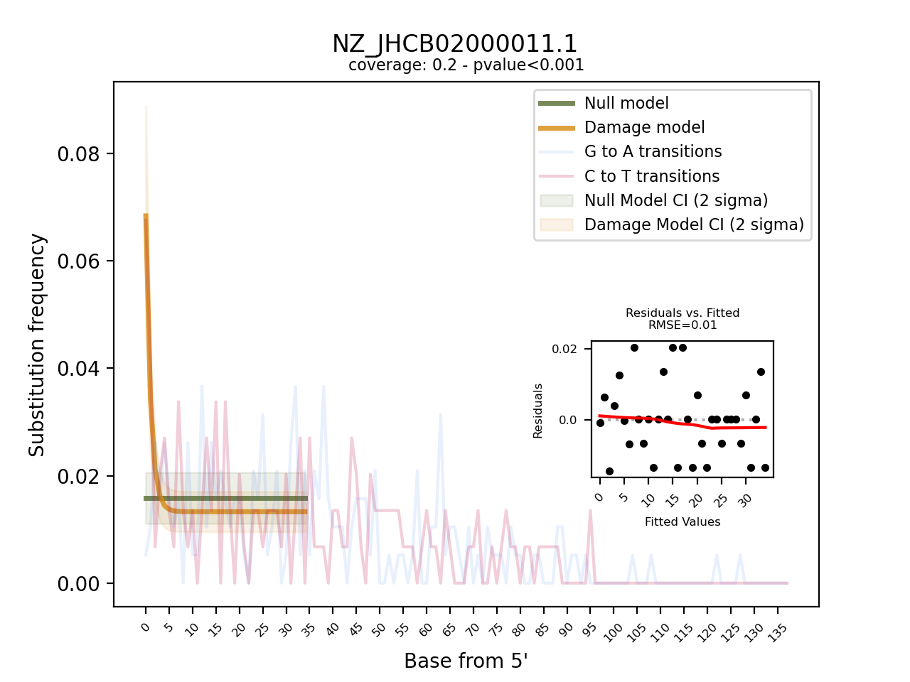

# Output

Pydamage generates both a tabular and a visual output.

The tabular outputs are  comma-separated file (`.csv`) with the following columns, for each analysed reference:

### `pydamage_results.csv` 

* `reference`: name of the reference genome/contig
* `predicted_accuracy`: Predicted accuracy of Pydamage prediction, from the GLM modelling
* `null_model_p0`: parameter `p0` of the null model
* `null_model_p0_stdev`: standard error of the null model paramater `p0`
* `damage_model_p`: parameter `p` of the damage model
* `damage_model_p_stdev`: standard error of the parameter `p` of the damage model
* `damage_model_pmin`: paramater `p_min` of the damage model. *This is the modelled damage baseline*
* `damage_model_pmin_stdev`: standard error of the paramater `p_min` of the damage model
* `damage_model_pmax`: paramater `p_max` of the damage model. *This is the modelled amount of damage on the 5' end.*
* `damage_model_pmax_stdev`: standard error of the paramater `p_max` of the damage model
* `pvalue`: p-value calculated from the likelihood-ratio test-statistic using a chi-squared distribution
* `qvalue`: p-value corrected for multiple testing using Benjamini-Hochberg procedure. *Only computed when multiple references are used*
* `RMSE`: residual mean standard error of the model fit of the damage model
* `nb_reads_aligned`: number of aligned reads
* `coverage`: average coverage along the reference genome
* `CtoT-N`: Proportion of CtoT substitutions observed at position `N` from 5' end
* `GtoA-N`: Proportion of GtoA substitutions observed at position `N` from 5'

### `pydamage_filtered_results.csv` 

Same file as above, but with contigs filtered with `qvalue <= 0.05` and `predicted_accuracy >= threshold` with a user defined filtering threshold (default = 0.5), or determined with the [kneedle](https://ieeexplore.ieee.org/document/5961514) method.

### Plots

The visual output are PNG files, one per reference contig. They show the frequency of observed C to T, and G to A transition at the 5' end of the sequencing data and overlay it with the fitted models for both the null and the damage model, including 95% confidence intervals. Furthermore, it provides a "residuals versus fitted" plot to help evaluate the fit of the pydamage damage model. Finally, the plot contains informtion on the average coverage along the reference and the p-value calculated from the likelihood-ratio test-statistic using a chi-squared distribution.

> The visual output is only produced when using the `--plot` flag

## Example

* [**Tabular ouput**](https://raw.githubusercontent.com/maxibor/pydamage/master/docs/assets/pydamage_results.csv)
* **Visual output**

